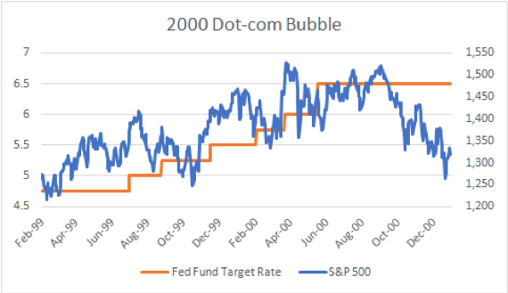
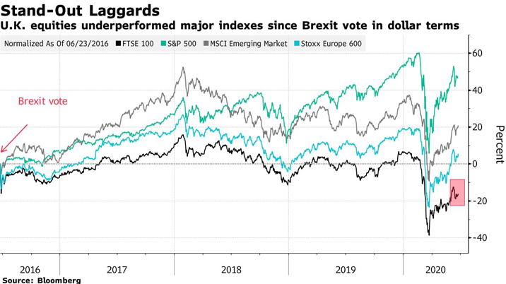

```{r setup, include=FALSE}
knitr::opts_chunk$set(echo = FALSE)
library(tseries) 
library(knitr)
library(moments)
library(scales)
library(zoo)
library(fGarch)
library(KScorrect)
library(ADGofTest)
library(VineCopula)
library(forecast)
library(here)

### Format a number as percentage
percent <- function(x, digits = 3, format = "f", ...) {
  paste0(formatC(100 * x, format = format, digits = digits, ...), "%")
}
```


## (a) Exploratory Analysis

Throughout this report, FTSE100 and S&P500 served as two selected stock indices. We obtain their weekly data from 3 Jan 2000 to 25 Dec 2020 and calculate their log returns respectively, using the following code. Here, 'coredata' function is used to extract the observations for returns, and stripe off their corresponding time index for simplicity.  

```{r}

options("getSymbols.warning4.0"=FALSE)
```


```{r, results = "hide", echo = TRUE}

##### Question (a)
### Download historical weekly prices for S&P500 and FTSE100 from 2000-01-03 to 2020-12-26
SP500 <- get.hist.quote(instrument = "^GSPC", start = "2000-01-03",
                         end = "2020-12-26", compression = "w", quote="Close")
FTSE100 <- get.hist.quote(instrument = "^FTSE", start = "2000-01-03",
                          end = "2020-12-26", compression = "w", quote="Close")

### Calculate the weekly log-returns and extract the values from the 'zoo' series
ret.SP500.tmp <- diff(log(SP500), lag = 1)
ret.FTSE100.tmp <- diff(log(FTSE100), lag = 1)
ret.SP500 <- coredata(ret.SP500.tmp)
ret.FTSE100 <- coredata(ret.FTSE100.tmp)
```

The figures shown below give an overview of the fluctuations of log-returns on S&P500 and FTSE100 during 2000-2020.

```{r Overview, fig.cap = "Weekly log-returns for S\\&P500 and FTSE100, 2000-2020", fig.height = 3, fig.align='center'}

### Time series plots for log-returns
par(mfrow = c(1, 2))
plot(ret.SP500.tmp, cex.lab = 0.6, cex.axis = 0.6, xlab = "", ylab = "SP500 log-returns")
plot(ret.FTSE100.tmp, cex.lab = 0.6, cex.axis = 0.6, xlab = "", ylab = "FTSE100 log-returns")
```


The summary table including mean, median, standard deviation, minimum, maximum, skewness and kurtosis is as follows:  

```{r Summary, message = FALSE}

### Print the summary table
Stock <- c('S&P 500', 'FTSE 100')
ret.mean <- c(percent(mean(ret.SP500), 3), percent(mean(ret.FTSE100), 3))
ret.median <- c(percent(median(ret.SP500)), percent(median(ret.FTSE100)))
ret.sd <- c(percent(sd(ret.SP500)), percent(sd(ret.FTSE100)))
ret.min <- c(percent(min(ret.SP500)), percent(min(ret.FTSE100)))
ret.max <- c(percent(max(ret.SP500)), percent(max(ret.FTSE100)))
ret.skewness <- c(round(skewness(ret.SP500), 3), round(skewness(ret.FTSE100), 3))
ret.kurtosis <- c(round(kurtosis(ret.SP500), 3), round(kurtosis(ret.FTSE100), 3))
# ret.p <- c(percent(jarque.bera.test(ret.SP500)$p.value, digits = 4),
#            percent(jarque.bera.test(ret.FTSE100)$p.value, digits = 4))

ret.summary <- data.frame(Stock, Mean = ret.mean, Median = ret.median, Sd = ret.sd,
                          Min = ret.min, Max = ret.max, Skewness = ret.skewness,
                          Kurtosis = ret.kurtosis)

kable(ret.summary, caption = "S&P500 and FTSE100 weekly log-return summary table")
```

\newpage

From the above table we see that the kurtosis for S&P500 and FTSE100 are 7.784 and 12.386 respectively, which are larger than Normal distribution with kurtosis = 3, indicating that the log-returns have a heavier tail than Normal distribution. The skewness are -0.963 and -1.267 respectively, which means the distributions of log-returns are asymmetric and the negative values imply that the distributions are left skewed. We then check the normality visually by plotting their relative plots.

```{r Normality, fig.cap = "Density plots and Q-Q plots for S\\&P500 (Left) and FTSE100 (Right)", fig.align='center', fig.height = 6}

par(mfrow = c(2, 2))

### Density plots for log-returns
plot(density(ret.SP500), main = "Density plot for S&P500")
plot(density(ret.FTSE100), main = "Density plot for FTSE100")

### Q-Q plots for log-returns
qqnorm(ret.SP500, cex = 0.4, main = "Q-Q plot for S&P500")
qqline(ret.SP500, lty = 2, col = "red")
qqnorm(ret.FTSE100, cex = 0.4, main = "Q-Q plot for FTSE100")
qqline(ret.FTSE100, lty = 2, col = "red")
```

According to the density plot, the deviation from the theoretical bell curve seems not too significant but there appears to be a heavier tail which coincides with our previous findings. For qqplot, which shows the distribution of the data against the expected normal distribution, not all quantile points lie along the theoretical red line, especially near the tails.  

Then, to test whether the log returns follow a normal distribution formally, a series of tests can be performed. Both Shapiro test and Jarque Bera test give very low p values, which reject the null hypothesis of normality, potentially because they are time varying. Hence, we conclude that there is less evidence to support the normality assumption.

\newpage

```{r, echo = TRUE}

# Normality tests
shapiro.test(ret.SP500); shapiro.test(ret.FTSE100)
jarque.bera.test(ret.SP500); jarque.bera.test(ret.FTSE100)
```


## (b) Value at Risk: Historical Simulation approach

We construct an equally weighted portfolio as required, using log-returns of S&P500 and FTSE100. After that, we calculate the Value at Risk, which is the maximum expected loss over a given period at 95% and 99% confidence level, respectively. Code and results are listed below:

```{r, echo = TRUE}

##### Question (b)
### Estimate VaR using Historical Simulation approach

Pof <- cbind(ret.SP500, ret.FTSE100)                          # Combine two log-returns 
w <- matrix(c(0.5, 0.5))                                      # Equal portfolio weights

ret.Pof <- log(1+((exp(Pof[,1])-1)+(exp(Pof[,2])-1))*(1/2))   # Portfolio log-returns
ret.Pof.s <- sort(ret.Pof)                                    # Sort the log-returns

VaR.HS.99 <- -quantile(ret.Pof.s, 0.01)                       # Calculate 99% VaR using HS
VaR.HS.95 <- -quantile(ret.Pof.s, 0.05)                       # Calculate 95% VaR using HS

cat("The 99% 1-week VaR of the portfolio using Historical Simulation approach is ",
    percent(VaR.HS.99), ".", sep = "")
cat("The 95% 1-week VaR of the portfolio using Historical Simulation approach is ",
    percent(VaR.HS.95), ".", sep = "")
```

Historical Simulation approach does not introduce parameters and is purely based on the past observed returns, which make it intuitive and can be easily interpreted for individual traders. Besides, when working with portfolio, HS can capture nonlinear dependence by directly using the portfolio returns without analysing each asset in the portfolio. However, HS does have a few drawbacks. Firstly, it relies on the quality of the historical dataset completely, thus the accuracy of HS can only be as good as historic data. Here, we calculate VaR by including market data for the past 20 years, which may not be reflective of the same market today. For instance, the financial crisis during 2007-2009 can have a downward influence on returns. Secondly, it cannot adapt with the changes of market structure, such as the federal reserve rate hike, which causes 2000 Dot-com Bubble and 2007 housing Bubble. Other macroeconomic events such as Brexit and its extending, the China-US trade war and more recently, the coronavirus pandemic may affect the stock market as well. (Figures available in Appex.B) Especially given the fact that many firms within FTSE100 make a large fraction of their profits in US dollars. (We can try to solve this either by using most recent data or by giving more weight on recent observations, which consequently leads to exacerbation of standard error.)


## (c) Parametric approach

Under the assumption that the joint distribution of log-returns is bivariate normal, we calculate the VaR for the portfolio using parametric approach:
$$
VaR_{\alpha,P} = \Phi^{-1}(\alpha)\sigma_P - \mu_P, \ \ \text{where} \ \ \sigma_P^2 = \mathbf{w' \Sigma w},\  \mu_P = \mathbf{w' \mu}. 
$$
The expected return is estimated using the sample mean and the standard deviation is estimated using the sample covariance matrix. Code and results are listed below:

```{r, echo = TRUE}

##### Question (c)
### Estimate VaR using parametric approach based on normality assumption
sigma <- sqrt(t(w) %*% cov(Pof) %*% w)      # Estimate portfolio volatility
mu <- t(w) %*% apply(Pof, 2, "mean")        # Estimate portfolio mean

VaR.Para.99 <- as.numeric(-sigma * qnorm(0.01) - mu)   # 99% VaR using Parametric
VaR.Para.95 <- as.numeric(-sigma * qnorm(0.05) - mu)   # 95% VaR using Parametric

cat("The 99% 1-week VaR of the portfolio using parametric approach is ",
    percent(VaR.Para.99), ".", sep = "")
cat("The 95% 1-week VaR of the portfolio using parametric approach is ",
    percent(VaR.Para.95), ".", sep = "")

skewness(ret.Pof)[1]
kurtosis(ret.Pof)[1]
```

```{r, fig.align = 'center', out.width = "80%", fig.cap = "Density plot for the portfolio"}
plot(density(ret.Pof), main = "")
```
The primary advantage of parametric approach is that it is fast and simple for computation. By assuming normality, we automatically know where the worst 5% and 1% locate. Since the parameter estimation includes volatility updates, there is no need to assume that the distribution of returns is stationary over time. However, it relies heavily on the assumption of normal distribution, and it is widely believed that the returns of the market have larger tails than the true normal distribution and the volatility is time varying. After calculation, we have a skewness of -1.085, which differs from the theoretical zero value for normal distribution, and the kurtosis result (greater than 3, rule of thumb) also verifies this. For highly skewed distributions, the effectiveness of Central Limit Theorem may be eliminated.

## (d) Copula-based Monte Carlo approach

Based on copula theory, we have the following procedure for Monte Carlo simulation approach to estimate portfolio VaR:

1. Identify two AR models by observing ACF and PACF for the log-returns of S&P 500 and FTSE 100, respectively. Also, we need to check if a GARCH model is necessary (and if the series is indeed i.i.d) by observing ACF for the squared log-returns. No MA models will be considered in this case.  
2. Fit the models found in Step 1.  
3. Evaluate the fitted models using ACF plots for the residuals and the squared residuals, followed by a Ljung–Box test to confirm the series is uncorrelated.   
4. Transform the residuals to copula data 'u' $\sim U(0, 1)$ using corresponding conditional distribution functions (CDF) and check if the generated 'u' is uniformly distributed using Kolmogorov-Smirnov test. (Step 1-4 is the Box-Jenkins approach to fit a model.)  
5. Select an appropriate bivariate copula family given 'u' and estimate the corresponding parameters using function 'BiCopSelect'.  
6. Simulate 10,000 bivariate observations given the copula selected in Step 5.  
7. Invert the simulated random bivariate observations using the inverse CDF of $N(0, 1)$. (We assume the marginal models are N(0,1), completely ignoring the results above.)  
8. Compute the simulated portfolio returns and then the VaR.  

First, we have the following ACF and PACF plots:

\newpage

```{r, results = "hide", fig.align = 'center', fig.cap = "ACF and PACF plots for S\\&P500 and FTSE100"}

##### Question (d)
### Building AR models: the Box - Jenkins approach
### Step 1: Identification
par(mfrow=c(3,2), mai = c(0.4, 0.3, 0.4, 0.3))

acf(ret.SP500, col="green", lwd=2, main = "ACF plot for S&P500")
acf(ret.FTSE100, col="green", lwd=2, main = "ACF plot for FTSE100")

pacf(ret.SP500, col="green", lwd=2, main = "PACF plot for S&P500")
pacf(ret.FTSE100, col="green", lwd=2, main = "PACF plot for FTSE100")

acf(ret.SP500^2, col="red", lwd=2, main = "ACF plot for S&P500^2")
acf(ret.FTSE100^2, col="red", lwd=2, main = "ACF plot for FTSE100^2")

### Test using auto.arima with criterion BIC 
temp1 <- auto.arima(ret.SP500, ic = "bic", allowmean = TRUE, max.q = 0)
temp2 <- auto.arima(ret.FTSE100, ic = "bic", allowmean = TRUE, max.q = 0)
```


For S&P500, it appears to be no ACF and PACF and the spike of PACF at lag 1 and 4 are not significant. Hence, an AR(0) model is selected for S&P500, which is also suggested by 'auto.arima' with criterion BIC. For FTSE100, the spike of PACF at lag 3 is considerable and accordingly, the ACF decays at lag 3 simultaneously. Hence, we would like to choose AR(3) for FTSE100. After fitting the chosen models, there seem to be no ACF for both residuals and squared residuals indicating good fits. Here are the Ljung–Box test results for the chosen models:

```{r, results = "hide"}

### Step 2: Estimation
model.SP500 = garchFit(formula=~arma(0,0)+garch(1,1),data=ret.SP500,trace=F, cond.dist = "std")
model.FTSE100 = garchFit(formula=~arma(3,0)+garch(1,1),data=ret.FTSE100,trace=F,cond.dist="norm")
```

```{r, results = "hide", fig.show = "hide"}

### Step 3: Model checking
# returns SP500
res.SP500 <- residuals(model.SP500, standardize=TRUE)
par(mfrow=c(2,1))
acf(res.SP500, col="green", lwd=2)
acf(res.SP500^2, col="red", lwd=2)
par(mfrow=c(1,1))
Box11 <- Box.test(res.SP500, lag = 10, type = c("Ljung-Box"), fitdf = 1)
Box12 <- Box.test(res.SP500^2, lag = 10, type = c("Ljung-Box"), fitdf = 1)
model.SP500@fit$ics

# returns FTSE100
res.FTSE100 <- residuals(model.FTSE100, standardize=TRUE)
# par(mfrow=c(2,1))
# acf(res.FTSE100, col="green", lwd=2)
# acf(res.FTSE100^2, col="red", lwd=2)
# par(mfrow=c(1,1))
Box21 <- Box.test(res.FTSE100, lag = 10, type = c("Ljung-Box"), fitdf = 3)
Box22 <- Box.test(res.FTSE100^2, lag = 10, type = c("Ljung-Box"), fitdf = 3)
model.FTSE100@fit$ics
```

```{r Box test, message = FALSE}

### Print the Box test results
NameRes <- c('S&P500', 'FTSE100')
Box.Or <- c(Box11$p.value, Box21$p.value)
Box.Sq <- c(Box12$p.value, Box22$p.value)

ret.summary <- data.frame(Residuals = NameRes, Original = Box.Or, Squared = Box.Sq)

kable(ret.summary, caption = "VaR summary table for all three methods")
```

We see that all the p-values are quite large, thus we cannot reject the null hypothesis that there is no autocorrelation, that is, now the residuals seem independent. To get a smallest possible Kolmogorov-Smirnov test p-value, we tried the combinations of every potential AR models and marginal distributions with corresponding CDF. It truned out that for S&P500, when choosing Student's t-distribution with mean = 0, sd = 1, the KS test p-value reaches the peak, 0.1622, which indicates significant evidence that the copula data is drawn from standard uniform distribution; for FTSE100, when choosing Normal distribution with mean = 0, sd = 1, the KS test p-value reaches the peak, 0.0048. Although the p-value is too small to validate the uniformity assumption, we have tried every possibilities and the model is the best one we can find for AR(p)-GARCH(1,1) with different 'cond.dist'. It probably can be improved by introducing other GARCH extensions such as TGARCH and APARCH. Below are the probability integral transform histograms for the copula data.

```{r, results = 'hide', fig.align = 'center', fig.cap = "PIT Histograms for S\\&P500 and FTSE100", fig.height = 2.9}

### Step 4: Transform to U(0, 1) and check uniformity
u.SP500<-pstd(res.SP500, mean=0, sd=1)[4:length(ret.SP500)]
u.FTSE100<-pnorm(res.FTSE100)[4:length(ret.FTSE100)]

par(mfrow = c(1, 2))
hist(u.SP500, freq = FALSE, col = "blue", main = "u.S&P500(PIT)", cex.lab = 0.6, cex.axis = 0.6)
hist(u.FTSE100, freq = FALSE, col = "green", main = "u.FTSE100(PIT)", cex.lab = 0.6, cex.axis = 0.6)

### Further distributional checks
### Kolmogorov-Smirnov test
KStest1<-LcKS(u.SP500, cdf = "punif")
KStest1$p.value
KStest2<-LcKS(u.FTSE100, cdf = "punif")
KStest2$p.value
```

Next, we use 'BiCopSelect' to select an appropriate bivariate copula using criterion AIC after testing the independence of the copula data. The copula selected is Student-t copula with two parameters being 0.75 and 12.4 respectively, and the dependence measurement Kendall's tau is 0.54. The dependence structure of the copula can be described by the linear correlation coefficient. It has tail dependence but it imposes symmetry in both tails. Then we simulate random observations given the Student-t copula with a seed set to achieve same results. Assuming both marginal distributions are $N(0, 1)$, we can easily simulate a series of pseudo log-returns and compute the VaR. The results are listed below: (Full code available in Appx.A)

```{r, results = 'hide'}

### Step 5: Copula modelling
model=BiCopSelect(u.SP500, u.FTSE100, familyset=NA, selectioncrit="AIC", indeptest=TRUE, level=0.05)
```

```{r, results = "hide"}

### Step 6: Simulate random observations given the selected copula
N=10000
set.seed(20045458) # Set seed to get same result every time
u.sim=BiCopSim(N, family=model$family, model$par, model$par2)

### Step 7: Invert u.sim using inverse CDF
# Here we are assuming marginal models are N(0,1), completely ignoring the results above.
y1simulated=qnorm(u.sim[,1], mean = 0, sd = 1) 
y2simulated=qnorm(u.sim[,2], mean = 0, sd = 1) 
```

```{r, echo = TRUE}

### Step 8: Value-at-Risk uisng Monte Carlo simulation
portsim <- matrix(0, nrow = N, ncol = 1)
varsim <- matrix(0, nrow = 1, ncol = 2)
portsim=log(1+((exp(y1simulated)-1)+(exp(y2simulated)-1))*(1/2))
VaR.MC.99 <- -quantile(portsim, 0.01)
VaR.MC.95 <- -quantile(portsim, 0.05)
cat("The 99% 1-week VaR of the portfolio using Monto Carlo approach is ",
    percent(VaR.MC.99), ".", sep = "")
cat("The 95% 1-week VaR of the portfolio using Monto Carlo approach is ",
    percent(VaR.MC.95), ".", sep = "")
```

Monte Carlo methods essentially estimates the uncertainty in a model, and it can be applied to various types of portfolios. It is able to capture non-linearity and thus works well in non-linear models, along with complex pricing patterns. It is not bounded by the historical data, and can be extended to longer horizons, which provides a broader opportunity on observing possible outcomes, hence gives a clearer view to traders upon deciding an investment. Theoretically, as the number of the simulations tends to infinity, the MC estimates converges to specfic values. Compared with other approaches, it also shows probabilistic results, i.e. how likely each outcome is. By accounting for a wider range of risks, it sacrifices the easiness while computing as it requires higher computing skill, which is an apparent drawback, along with its consumption on time. The joint distribution assumption and parameters selection are vital, hence demanding extra carefulness in model selection. By introducing copula theory, we do not need to make any assumptions for the joint distribution and in this case it allows us to decompose a 2-demensional joint distribution into two marginal distributions and a bivariate copula function (Step 4-5), which makes the following simulations a lot easier. However, for convienience, here we assume that both marginal models for both log-returns are $N(0, 1)$ instead of using the estimated distributions in Step 4 (the actual variance cannot be as large as 1), thus the estimated VaR looks ridiculous and unreasonable. If we reduced the estimated variance or use the estimated distribution, the VaR would be more reasonable. Besides, contrast to reality, it may not create extreme values of returns as it may not reflect fat tails accurately.


## (e) VaR comparison

Here we have the summary table of VaR for all three methods:

```{r VAR, message = FALSE}

### Print the VaR summary table
NameVaR <- c('95% VaR', '99% VaR')
VaR.HS <- c(percent(VaR.HS.95), percent(VaR.HS.99))
VaR.Para <- c(percent(VaR.Para.95), percent(VaR.Para.99))
VaR.MC <- c(percent(VaR.MC.95), percent(VaR.MC.99))


ret.summary <- data.frame(VaR = NameVaR, HS.approach = VaR.HS,
                          Parametric.approach = VaR.Para, Monto.Carlo.approach = VaR.MC)

kable(ret.summary, caption = "VaR summary table for all three methods")
```

Normally, Monte Carlo approach would be the choice with priority, as it generates random trials and is flexible in terms of covering various types of portfolio. Here, we have assumed that the marginal models for log returns follow a standard normal distribution as required, which volatiles the true standard deviation, hence result in a dramatic difference compared with other approaches. We choose to use the parametric approach as an alternative, as it gives a relatively reasonable and consistent result. It is worth noticing that VaR does not measure the worst-case loss, traders should always bear in mind this limitation while investing.

\vspace{3cm}


# References

<div id="refs"></div>

---
nocite: | 
  @DanielssonJon2011FRFT, @2628584, @Michael, @Ravi, @Wipplinger, 
...

\newpage

# Appendix A: All code for this ICA

```{r ref.label=knitr::all_labels(), echo=TRUE, eval=FALSE}

```


\newpage

# Appendix B

```{r pic1, fig.align = 'center', out.width = "100%", fig.cap = "Influence of Federal Reserve rate hike on S\\&P500"}

```

```{r pic2, fig.align = 'center', out.width = "100%", fig.cap = " Influence of Brexit on uk stocks"}

```

